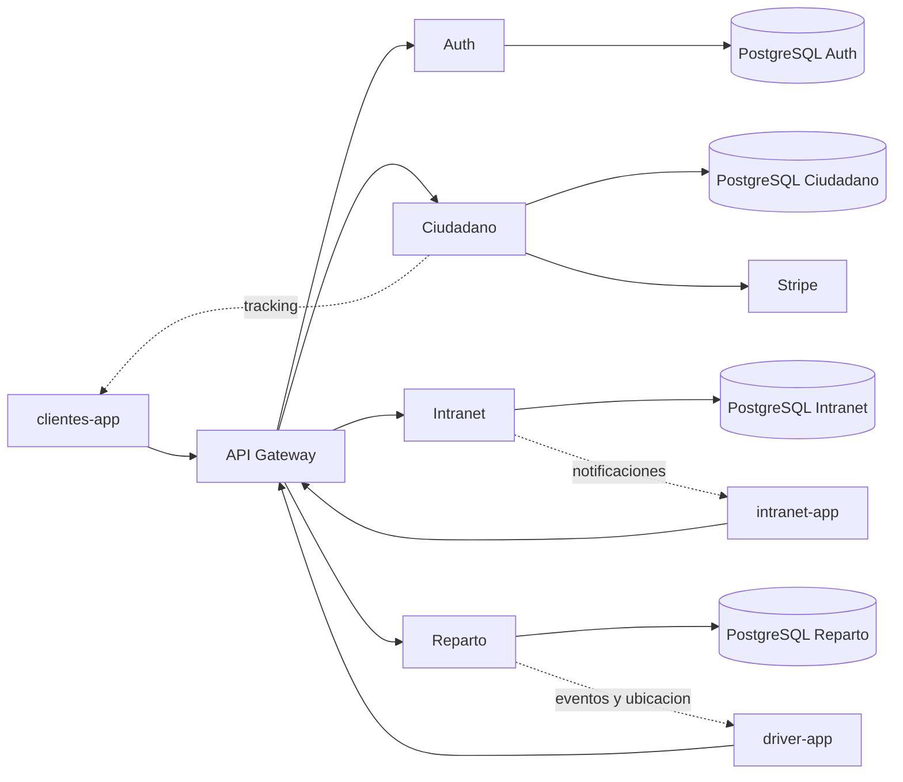

# Manual Tecnico de NexoPostal

## 1. Finalidad del documento

Este documento actua como anexo tecnico de la memoria principal del TFG y tiene cuatro objetivos concretos:

1. Explicar la arquitectura real del sistema NexoPostal en su estado actual.
2. Servir de guia de instalacion, ejecucion y despliegue.
3. Documentar los puntos de mantenimiento mas sensibles para futuras evoluciones.
4. Reducir el tiempo necesario para incorporar a otra persona al proyecto.

No sustituye a la memoria del TFG. La memoria justifica decisiones, alcance y resultados. Este manual tecnico baja al nivel operativo: componentes, dependencias, despliegue, integraciones, seguridad, persistencia y soporte.

---

## 2. Vision general del sistema

NexoPostal es una plataforma de paqueteria distribuida en torno a tres clientes Angular, un API Gateway y cuatro microservicios .NET especializados. El sistema cubre el ciclo completo de un envio:

1. Registro y autenticacion del usuario.
2. Calculo de tarifa.
3. Contratacion y pago del envio.
4. Admision logistica.
5. Clasificacion interna y movimientos troncales.
6. Liberacion a reparto.
7. Planificacion de ruta.
8. Entrega y seguimiento publico en tiempo real.

### 2.1 Aplicaciones cliente

- `clientes-app`: web publica para clientes finales.
- `intranet-app`: web interna para operativa, supervision y administracion.
- `driver-app`: aplicacion de reparto para `Repartidor` y `JefeReparto`.

### 2.2 Componentes backend

- `Nexopostal.Gateway`: punto unico de entrada HTTP.
- `Nexopostal.Auth`: identidad, autenticacion y sesiones.
- `Nexopostal.Ciudadano`: envios, tarifas, pagos, perfil, oficinas y tracking publico.
- `Nexopostal.Intranet`: CTAs, admision, asignaciones, movimientos, incidencias y backoffice.
- `Nexopostal.Reparto`: rutas, entregas, GPS, bandeja de reparto y gestion del equipo de ultima milla.
- `Nexopostal.Shared`: libreria transversal con errores de dominio, resultados, middleware y utilidades comunes.

### 2.3 Roles soportados

| Rol | Aplicacion principal | Responsabilidad |
| --- | --- | --- |
| Cliente | clientes-app | Contratar envios, pagar, consultar tracking y gestionar perfil |
| Admin | intranet-app | Backoffice global del sistema |
| OperarioOficina | intranet-app | Alta presencial, oficina y escaneo de oficina |
| OperarioCTA | intranet-app | Clasificacion y operativa del CTA |
| Supervisor | intranet-app | Coordinacion del CTA y equipo |
| Repartidor | driver-app | Ejecucion de la ruta y confirmacion de entregas |
| JefeReparto | driver-app | Planificacion y supervision de la ultima milla |

---

## 3. Arquitectura logica



### 3.1 Principios aplicados

- Separacion por dominios de negocio.
- Frontends especializados por contexto operativo.
- Una base de datos por microservicio.
- Identificadores compartidos, no relaciones fisicas entre motores distintos.
- API Gateway como frontera de exposicion externa.
- Tiempo real mediante SignalR solo donde aporta valor funcional.
- Contenedorizacion completa del entorno.

### 3.2 Identificadores clave del sistema

- `IdentityUserId`: relaciona identidad con perfiles operativos.
- `NumeroSeguimiento`: identificador publico del envio.
- `NumeroExpedicion`: identificador interno operativo del paquete.
- `RutaId`, `EntregaId`, `CtaId`: identificadores de los dominios internos.

### 3.3 Doble estado del envio

Una de las decisiones mas importantes es separar:

- Estado publico: visible para el cliente.
- Estado interno: usado por operativa, escaneo, clasificacion y reparto.

Esto evita exponer demasiado detalle al exterior y permite que la red logistica trabaje con una granularidad mayor que la mostrada al usuario final.

---

## 4. Descripcion de componentes

### 4.1 `clientes-app`

Responsabilidades principales:

- Registro, login y reseteo de contrasena.
- Calculadora de tarifas.
- Contratacion guiada de envios.
- Integracion con Stripe Checkout.
- Busqueda de oficinas.
- Tracking publico en tiempo real.
- Panel de usuario con perfil, agenda y documentos.

Puntos tecnicos destacables:

- Angular standalone components.
- Guards de acceso por autenticacion.
- Interceptores HTTP para JWT y politicas de reintento.
- Uso de senales para estado UI.
- Cache en memoria para sugerencias de oficinas.

### 4.2 `intranet-app`

Responsabilidades principales:

- Panel operativo para oficina, CTA y supervision.
- Alta presencial en oficina.
- Asignaciones y escaneo integrado.
- Seguimiento interno.
- Gestion de equipo.
- Backoffice administrativo.

Puntos tecnicos destacables:

- Distincion fuerte por rol en la navegacion.
- Integracion con SignalR interno.
- Superficies separadas para operativa y administracion.
- Soporte a incidencias y movimientos globales.

### 4.3 `driver-app`

Responsabilidades principales:

- Ruta activa del `Repartidor`.
- GPS y sincronizacion de ubicaciones.
- Cola offline para eventos criticos.
- Confirmacion de entregas con evidencias.
- Bandeja, rutas, supervision y gestion de equipo para `JefeReparto`.

Puntos tecnicos destacables:

- Geolocalizacion continua con control de segundo plano.
- Integracion con Leaflet y OpenStreetMap.
- Soporte offline con `localStorage`.
- Experiencia diferenciada por rol dentro de la misma app.

### 4.4 `Nexopostal.Auth`

Responsabilidades principales:

- Login y registro.
- Refresh token con rotacion y revocacion.
- Reseteo de contrasena por correo.
- Consulta del usuario autenticado.
- Bloqueo operacional de sesiones mediante endpoint interno.

Tecnologias y patrones:

- ASP.NET Core Identity.
- JWT.
- PostgreSQL.
- Migraciones EF Core.

### 4.5 `Nexopostal.Ciudadano`

Responsabilidades principales:

- Dominio de envios del cliente.
- Perfil ciudadano y agenda de direcciones.
- Calculo de tarifas.
- Pagos con Stripe.
- Etiqueta y factura.
- Directorio de oficinas.
- Tracking publico y hub de SignalR.

Aspectos de interes:

- Creacion del envio en `PendientePago`.
- Consolidacion del pago por verificacion y webhook.
- Proyeccion de tracking publico desde eventos internos.

### 4.6 `Nexopostal.Intranet`

Responsabilidades principales:

- Red de CTAs.
- Admision interna y alta presencial.
- Asignaciones operativas.
- Escaneo por modos.
- Movimientos troncales.
- Incidencias.
- Seguimiento interno.
- Backoffice administrativo.

Aspectos de interes:

- Encadenamiento de tareas por escaneo.
- Evento `DisponibleParaReparto` como frontera con ultima milla.
- Hub interno con grupos por CTA y rol.

### 4.7 `Nexopostal.Reparto`

Responsabilidades principales:

- Gestion del perfil operativo del repartidor.
- Rutas del dia.
- Entregas y confirmaciones.
- Registro de ubicacion.
- Bandeja persistente del `JefeReparto`.
- Reasignacion de paradas.
- Gestion de repartidores de ultima milla.

Aspectos de interes:

- `PaquetePendienteReparto` como staging previo a una ruta.
- Vistas de ubicaciones activas para supervision.
- Sincronizacion con Ciudadano para tracking.

---

## 5. Persistencia y modelo de datos

### 5.1 Reparto de bases de datos

Cada microservicio tiene su propia base PostgreSQL:

- Auth: identidad y credenciales.
- Ciudadano: perfiles, direcciones, oficinas, envios y tarifas.
- Intranet: CTAs, operarios, tareas, movimientos, incidencias y oficinas operativas.
- Reparto: repartidores, rutas, entregas, ubicaciones y paquetes pendientes de asignacion.

### 5.2 Tablas o agregados especialmente relevantes

#### Auth

- Usuarios Identity.
- Refresh tokens.
- Estados de sesion o bloqueo aplicables a control de acceso.

#### Ciudadano

- `Envios`.
- `ClientePerfiles`.
- `DireccionesFavoritas`.
- `Oficinas`.
- `TarifasBandas`.

#### Intranet

- `CentrosTratamiento`.
- `OperariosCta`.
- `OperariosOficina`.
- `AsignacionesPaquetes`.
- `MovimientosPaquetes`.
- `Incidencias`.
- `HistorialEstados`.
- `OficinasPostales`.

#### Reparto

- `Repartidores`.
- `RutasReparto`.
- `EntregasPaquetes`.
- `UbicacionesRepartidores`.
- `Vehiculos`.
- `PaquetesPendientesReparto`.

### 5.3 Consistencia entre servicios

No hay joins entre microservicios. La coherencia se logra mediante:

- Identificadores compartidos.
- Contratos HTTP internos.
- Propagacion de eventos de negocio.
- Persistencia local de cada dominio.

Esto obliga a asumir que una evolucion segura del sistema pasa por documentar bien los contratos y mantener consistencia de nomenclatura entre dominios.

### 5.4 Oficinas: estado actual

El catalogo de oficinas ha evolucionado respecto a iteraciones anteriores. En el estado actual:

- Ciudadano expone oficinas persistidas mediante API de listado y busqueda.
- Intranet mantiene el maestro operativo de oficinas postales.
- Existen paneles administrativos para altas, ediciones y activaciones.
- Siguen existiendo servicios de apoyo y seeders para inicializacion.

Concluson tecnica: las oficinas ya no deben tratarse como un simple JSON de frontend, sino como un recurso de dominio administrable.

---

## 6. Seguridad

### 6.1 Autenticacion

El sistema usa JWT para autenticacion de usuario final. Los puntos relevantes son:

- Firma, emisor y audiencia validados en backend.
- Expiracion sin margen adicional mediante `ClockSkew = TimeSpan.Zero`.
- Refresh tokens reales con rotacion y revocacion.
- Reseteo de contrasena por correo.

### 6.2 Autorizacion por rol

La autorizacion existe en tres niveles:

1. Guardias y navegacion del frontend.
2. Restricciones por rol en controladores y hubs.
3. Segmentacion funcional por aplicacion.

Ejemplo: un `JefeReparto` puede autenticarse en `driver-app`, pero no debe operar la vista de ruta del `Repartidor`.

### 6.3 Gateway como frontera de seguridad

El API Gateway define rutas publicas y protegidas. Son publicas, entre otras:

- Login.
- Registro.
- Refresh.
- Solicitud y reseteo de contrasena.
- Tracking publico.
- Tarifas.
- Busqueda de oficinas.
- Webhook de Stripe.

Todo lo demas requiere JWT valido.

### 6.4 Validacion de sesion bloqueada

El gateway incorpora una comprobacion adicional contra Auth para validar si la cuenta sigue operativa. Esto significa que un JWT valido no garantiza acceso si la cuenta ha sido bloqueada despues de emitirse el token.

Impacto operativo:

- El bloqueo por administrador tiene efecto practicamente inmediato.
- Se reduce el riesgo de sesion valida pero ya no autorizada.

### 6.5 Seguridad entre servicios

Se usa `X-Service-Key` para proteger endpoints internos sensibles, por ejemplo:

- Admision interna.
- Tracking interno.
- Validacion de sesion interna.
- Registro de paquetes en bandeja de reparto.

Es una solucion valida para el alcance del TFG, pero esta documentado como linea futura de mejora evolucionar a JWT de servicio o mTLS.

### 6.6 Seguridad de infraestructura

En produccion se usa:

- HTTPS en Nginx.
- HSTS.
- Cabeceras de seguridad web.
- Bases de datos sin exposicion publica directa.
- Red interna Docker para servicios.

---

## 7. Integraciones y tiempo real

### 7.1 Stripe

Usado para Checkout y verificacion de pago.

Elementos implicados:

- Creacion de sesion.
- Retorno del navegador.
- Webhook.
- Reintento de pagos pendientes.

### 7.2 SignalR

Se usa en tres ambitos:

- Tracking publico en Ciudadano.
- Notificaciones internas en Intranet.
- Eventos y notificaciones de reparto en `driver-app`.

### 7.3 Cartografia y navegacion

- Leaflet para representacion de mapa.
- OpenStreetMap para teselas.
- Google Maps y Waze para navegacion externa.

### 7.4 Geolocalizacion

El `Repartidor` registra ubicacion mediante el navegador y la envia al backend de reparto. La app combina:

- `watchPosition`.
- heartbeats.
- control de visibilidad.
- reintentos.
- cola offline.

---

## 8. Flujos tecnicos de extremo a extremo

### 8.1 Flujo de envio online y pago

1. El cliente completa el asistente de contratacion.
2. Ciudadano calcula el precio exacto y crea un envio en `PendientePago`.
3. Se crea la sesion de Stripe.
4. Stripe confirma el pago.
5. Ciudadano genera etiqueta y factura.
6. Ciudadano notifica a Intranet para la admision del envio.

### 8.2 Flujo logistico interno

1. Intranet resuelve el CTA destino.
2. Crea movimiento troncal si procede.
3. Registra historial y notifica a operativa.
4. El paquete avanza por escaneos y tareas.
5. El sistema distingue entre entrega en oficina y entrega en domicilio.

### 8.3 Liberacion a reparto

1. Clasificacion marca el envio como `DisponibleParaReparto`.
2. Intranet registra el paquete en la bandeja persistente de Reparto.
3. El `JefeReparto` lo visualiza y decide su asignacion.
4. Se crea una ruta nueva o se agrega a una existente.

### 8.4 Ejecucion de ultima milla

1. El `Repartidor` inicia la ruta.
2. Se activa GPS.
3. Se registran confirmaciones de entrega.
4. Reparto informa a Ciudadano.
5. El tracking publico se actualiza y se emiten eventos SignalR.

---

## 9. API Gateway: notas de mantenimiento

El gateway usa una configuracion explicita de `apiKey` y `routeKey`. Esto obliga a tener especial cuidado cuando se anaden endpoints nuevos.

### 9.1 Casos a recordar

- `POST /api/nexopostal/reparto/crear-ruta` existe porque la libreria del gateway no permite mismo `routeKey` con verbos distintos.
- `PUT /api/nexopostal/envios/interno-estado/{exp}/estado` usa una clave diferenciada respecto a la ruta GET interna.
- `POST /api/nexopostal/reparto/bandeja/{id}/asignar-a-ruta` depende de la convencion de reescritura del middleware.

### 9.2 Recomendacion practica

Cada vez que se anada o cambie un endpoint:

1. Actualizar configuracion del microservicio.
2. Actualizar mapeo del gateway.
3. Verificar si la ruta debe ser publica o privada.
4. Verificar si requiere `X-Service-Key`.
5. Ajustar frontend consumidor.

---

## 10. Patron de errores y resultados

El backend usa un patron ROP con `Result<T, DomainError>` y `UnitResult<DomainError>`.

Ventajas:

- Error uniforme entre controladores.
- Menor dispersion de logica de mapeo HTTP.
- Payload consistente para frontends.

Tipos de error frecuentes:

- `NotFoundError`.
- `ValidationError`.
- `ConflictError`.
- `BusinessRuleError`.
- `UnauthorizedError`.
- `ForbiddenError`.
- `InfrastructureError`.

Payload de error uniforme:

```json
{
  "errorId": "8 chars",
  "code": "ENVIO_NOT_FOUND",
  "message": "Envio no encontrado",
  "errorType": "NotFoundError",
  "timestamp": "ISO-8601",
  "path": "/api/...",
  "method": "GET"
}
```

---

## 11. Puesta en marcha local

### 11.1 Requisitos

- Docker Desktop o motor Docker compatible.
- Docker Compose V2.
- Git.

Opcional, para trabajo fuera de contenedores:

- .NET SDK 10.
- Node.js 22.

### 11.2 Arranque rapido recomendado

```bash
docker compose up -d --build
```

### 11.3 URLs locales

- Clientes: `http://localhost`
- Intranet: `http://localhost:4202`
- Driver: `http://localhost:4201`

### 11.4 Cuentas de prueba en desarrollo

Si el seeding esta activo, el entorno dispone de cuentas demo como:

- `admin@nexopostal.es` / `Admin123!`
- `operario@nexopostal.es` / `Operario123!`
- `operario.cta@nexopostal.es` / `Operario123!`
- `supervisor@nexopostal.es` / `Operario123!`
- `repartidor@nexopostal.es` / `Repartidor123!`
- `jefe.reparto@nexopostal.es` / `Repartidor123!`
- `cliente@example.com` / `Cliente123!`

### 11.5 Parada del entorno

```bash
docker compose down
```

### 11.6 Logs utiles

```bash
docker compose logs -f api-gateway
docker compose logs -f modulo-ciudadano
docker compose logs -f modulo-logistica
docker compose logs -f modulo-reparto
docker compose logs -f modulo-seguridad
```

---

## 12. Desarrollo fuera de contenedores

### 12.1 Backend

```bash
cd microservicios/Nexopostal
dotnet restore
dotnet build
```

### 12.2 Frontend

Para cada app Angular:

```bash
npm ci
npm run build -- --configuration production
```

### 12.3 Tests

En este proyecto conviene ejecutar al menos:

- build de microservicios.
- build de frontends.
- pruebas del proyecto `Nexopostal.Tests` cuando se toquen dominios compartidos.

---

## 13. Migraciones y cambios de modelo

### 13.1 Regla general

Aunque varios servicios aplican migraciones al arrancar, cualquier cambio de modelo debe acompanarse de una migracion EF Core explicita.

### 13.2 Punto especialmente sensible

En Auth no debe confiarse en que el despliegue "adivine" cambios de modelo. Si se modifica identidad o almacenamiento asociado, hay que generar y revisar la migracion antes de publicar.

### 13.3 Recomendacion operativa

Cuando se cambie un modelo:

1. Generar migracion.
2. Revisar SQL o dif resultante.
3. Actualizar seeding si procede.
4. Verificar compatibilidad con contratos API.
5. Reejecutar arranque local completo.

---

## 14. Despliegue en produccion

### 14.1 Estrategia

Produccion usa imagenes en GHCR y `docker-compose.production.yml`. El VPS no compila el proyecto: descarga imagenes ya construidas.

### 14.2 Comando base

```bash
docker compose --env-file ./.env -f docker-compose.production.yml pull
docker compose --env-file ./.env -f docker-compose.production.yml up -d --no-build
```

### 14.3 Elementos necesarios en el VPS

- Archivo `.env` de produccion.
- `docker-compose.production.yml`.
- `nginx/nginx.production.conf`.
- Certificados en `nginx/certs`.

### 14.4 Nginx y dominios

Dominios previstos:

- `https://nexopostal.es`
- `https://intranet.nexopostal.es`
- `https://driver.nexopostal.es`

Nginx resuelve:

- SPA publica.
- SPA intranet.
- SPA de reparto.
- WebSockets para tracking, intranet y reparto.
- Proxy hacia el gateway y microservicios donde corresponde.

### 14.5 Consideraciones de certs

El pipeline contempla un certificado temporal autofirmado si no existen certs reales, pero eso solo debe entenderse como salvaguarda tecnica inicial. Para uso real deben instalarse certificados validos.

---

## 15. CI/CD

### 15.1 Flujo automatizado

El workflow principal:

1. Compila backend .NET.
2. Compila frontends Angular.
3. Construye imagenes Docker.
4. Publica imagenes en GHCR.
5. Si el push es a `master`, despliega en el VPS por SSH.

### 15.2 Etiquetado de imagenes

Las imagenes se publican, como minimo, con:

- hash SHA de commit.
- etiqueta `latest` o equivalente segun rama.

### 15.3 Ventajas del enfoque

- Despliegues reproducibles.
- Separacion clara entre build y runtime.
- Rollback mas sencillo por etiqueta de imagen.
- Menor carga en el VPS.

---

## 16. Observabilidad y operacion

Existe un compose adicional para monitorizacion con componentes como:

- Watchtower.
- Prometheus.
- Grafana.
- Loki.
- Promtail.

Esto no es obligatorio para el funcionamiento basico, pero sirve como base para evolucionar la plataforma hacia un entorno mas observable.

### 16.1 Operaciones recomendadas de supervision

- Revisar logs del gateway cuando falle una ruta o autenticacion.
- Revisar Ciudadano cuando haya discrepancias de pago o tracking.
- Revisar Intranet cuando no aparezca un paquete en la cadena logistica.
- Revisar Reparto cuando no llegue a bandeja o no se asigne correctamente.

---

## 17. Incidencias frecuentes y resolucion

### 17.1 El usuario tiene token valido pero no puede acceder

Posible causa:

- Cuenta bloqueada y gateway cortando acceso por validacion de sesion.

Revision:

- Ver estado del usuario en backoffice.
- Revisar logs del gateway y Auth.

### 17.2 Error 403 en comunicacion interna

Posible causa:

- `X-Service-Key` incorrecta o desincronizada.

Revision:

- Confirmar `InterServiceSettings:ServiceKey`.
- Confirmar `env_file` y variables cargadas en todos los .NET.

### 17.3 Problemas JWT en .NET 10

Posible causa:

- Clave JWT demasiado corta.

Revision:

- Verificar longitud minima suficiente de `JWT_SECRET_KEY`.

### 17.4 El paquete no llega a reparto

Posible causa:

- El envio aun no ha alcanzado `DisponibleParaReparto`.
- Fallo al registrar en bandeja persistente.

Revision:

- Confirmar historial interno.
- Confirmar evento de escaneo correcto.
- Revisar logs de Intranet y Reparto.

### 17.5 El tracking publico no refleja la entrega

Posible causa:

- Reparto confirmo la entrega, pero Ciudadano no consolido el evento.

Revision:

- Revisar endpoint interno entre Reparto y Ciudadano.
- Verificar `X-Service-Key` y logs de tracking.

### 17.6 Problemas de DNS entre contenedores en produccion

Posible causa:

- Resolucion de nombres cacheada por Nginx tras recreacion de contenedores.

Revision:

- Verificar `resolver 127.0.0.11` en configuracion de Nginx.

---

## 18. Recomendaciones para evolucion futura

1. Sustituir o complementar `X-Service-Key` con autenticacion de servicio mas robusta.
2. Introducir patrones outbox/inbox para integracion entre dominios.
3. Ampliar cobertura de pruebas de integracion extremo a extremo.
4. Consolidar observabilidad funcional, no solo tecnica.
5. Documentar formalmente versionado de contratos internos.

---

## 19. Cierre

NexoPostal ya no debe entenderse como una demo aislada de frontend con API. Su estado actual es el de una plataforma distribuida con separacion clara de dominios, despliegue automatizado, integraciones externas reales y una frontera bien definida entre contratacion, logistica y ultima milla. Este manual tecnico pretende dejar ese estado documentado desde una perspectiva mantenible y operativa.