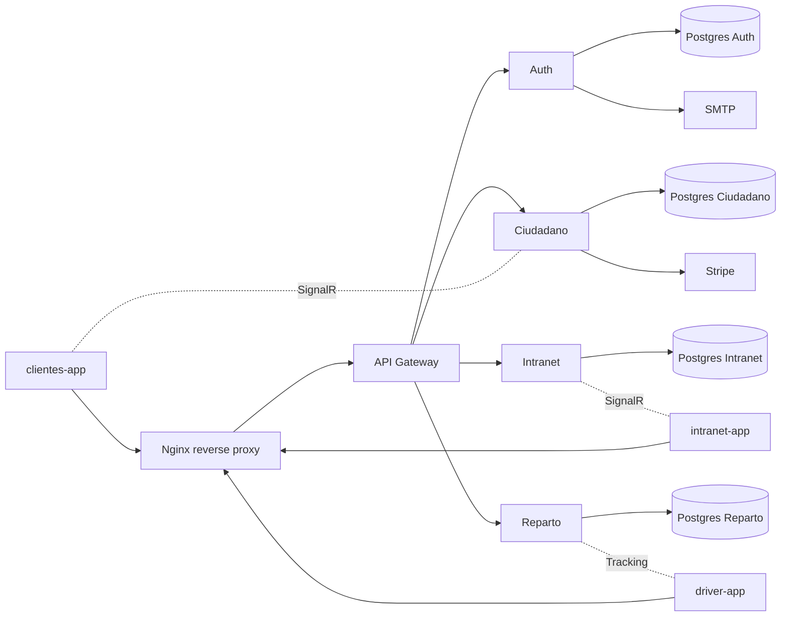

# NexoPostal

NexoPostal es una plataforma end-to-end de paqueteria compuesta por tres aplicaciones Angular y una arquitectura de microservicios .NET 10. El sistema cubre el ciclo completo de un envio: registro y autenticacion, cotizacion, pago, admision, operativa interna, reparto y seguimiento en tiempo real.

## Estado del proyecto

- Aplicacion finalizada y preparada para ejecucion local, automatizacion y despliegue.
- Monorepo con frontend, backend, infraestructura, pruebas y pipeline de CI/CD.
- Despliegue productivo basado en imagenes Docker publicadas en GHCR.

## Aplicaciones

| Aplicacion | Dominio funcional | Capacidades principales |
|---|---|---|
| clientes-app | Portal publico de clientes | registro, login, cotizacion, creacion de envios, pago con Stripe Checkout, tracking, descarga de etiqueta/factura PDF, gestion de direcciones y oficinas |
| intranet-app | Operativa y logistica interna | dashboard, admision, gestion de CTAs, asignaciones, incidencias, escaneos, oficinas y notificaciones internas |
| driver-app | Herramienta de reparto | bandeja de trabajo, rutas, entregas, cambios de estado, confirmaciones y envio de ubicacion |

## Roles soportados

| Rol | Aplicacion principal |
|---|---|
| Cliente | clientes-app |
| Admin | intranet-app |
| OperarioOficina | intranet-app |
| OperarioCTA | intranet-app |
| Supervisor | intranet-app |
| Repartidor | driver-app |
| JefeReparto | driver-app |

## Stack tecnologico

- Frontend: Angular 21, Tailwind CSS 4, SignalR y Leaflet.
- Backend: ASP.NET Core 10, EF Core 10, Identity, JWT, FluentValidation, Serilog y CSharpFunctionalExtensions.
- Infraestructura: Docker, Docker Compose, Nginx, PostgreSQL 16, GitHub Actions y GHCR.
- Integraciones: Stripe Checkout + webhooks, SMTP para correo transaccional y SignalR para notificaciones/tracking.

## Arquitectura



### Decisiones tecnicas relevantes

- Un API Gateway centraliza el acceso a los microservicios y desacopla a las SPAs de las rutas internas.
- Cada microservicio mantiene su propia base de datos PostgreSQL.
- `Nexopostal.Shared` unifica errores, resultados, validacion y middleware transversal.
- El backend usa un patron ROP con `Result<TDto, DomainError>` y `UnitResult<DomainError>` para mapear respuestas HTTP de forma consistente.

## Estructura del repositorio

| Ruta | Contenido |
|---|---|
| `clientes-app/` | SPA Angular del portal de clientes |
| `intranet-app/` | SPA Angular de operativa interna |
| `driver-app/` | SPA Angular para repartidores |
| `microservicios/Nexopostal/` | solucion .NET 10 con Gateway, Auth, Ciudadano, Intranet, Reparto, Shared y tests |
| `nginx/` | configuraciones de proxy local y produccion |
| `documentacion/diagramas/` | diagramas y documentacion complementaria |
| `.github/workflows/` | pipeline de build, pruebas, empaquetado y despliegue |

## Arranque local rapido

### Requisitos

- Docker Desktop
- PowerShell 7 recomendado para ejecutar los scripts del repositorio
- .NET SDK 10 y Node.js 22 solo si vas a ejecutar tests o levantar apps fuera de Docker

### Pasos

1. Copia la plantilla de variables de entorno:

```powershell
Copy-Item .env.example .env
```

2. Revisa al menos estos bloques del archivo `.env`:
   - JWT (`JWT_SECRET_KEY` debe tener al menos 32 caracteres reales)
   - PostgreSQL (`POSTGRES_*` para los cuatro modulos)
   - Stripe (`STRIPE_SECRET_KEY`, `STRIPE_WEBHOOK_SECRET`)
   - SMTP (`SMTP_*`)
   - Comunicacion interna (`INTER_SERVICE_KEY`)

3. Levanta toda la plataforma:

```powershell
docker compose up -d --build
```

4. Accede a las aplicaciones:

| Entorno local | URL |
|---|---|
| Portal de clientes | http://localhost |
| Intranet | http://localhost:8202 |
| Driver app | http://localhost:8201 |

### Notas del primer arranque

- El modulo Auth aplica migraciones y siembra usuarios demo automaticamente.
- En desarrollo local se exponen las bases de datos en los puertos 15432, 15433, 15434 y 15435.
- El archivo `.env.example` es la referencia base de configuracion para todos los servicios.

## Variables de entorno

El contrato completo esta en `.env.example`. Los grupos mas importantes son estos:

| Grupo | Variables clave | Uso |
|---|---|---|
| Autenticacion | `JWT_SECRET_KEY`, `JWT_ISSUER`, `JWT_AUDIENCE`, `JWT_EXPIRY_MINUTES` | emision y validacion de tokens JWT |
| Microservicios | `URL_MODULO_*`, `URL_API_GATEWAY`, `INTER_SERVICE_KEY` | descubrimiento interno y llamadas seguras entre servicios |
| Bases de datos | `POSTGRES_AUTH_*`, `POSTGRES_CIUDADANO_*`, `POSTGRES_INTRANET_*`, `POSTGRES_REPARTO_*` | conexion de cada modulo con su PostgreSQL |
| Pagos | `STRIPE_SECRET_KEY`, `STRIPE_WEBHOOK_SECRET` | checkout y confirmacion de pagos |
| Correo | `SMTP_*`, `FRONTEND_URL` | recuperacion de contrasena y notificaciones por email |
| Proxy y dominios | `DOMINIO_*`, `NGINX_HTTP_PORT`, `NGINX_HTTPS_PORT` | resolucion local y despliegue productivo |

## Usuarios demo

Estas cuentas se crean desde el seed del modulo Auth. Son solo para desarrollo local y entornos de prueba.

| App | Rol | Email | Password |
|---|---|---|---|
| Intranet | Admin | admin@nexopostal.es | Admin123! |
| Intranet | OperarioOficina | operario@nexopostal.es | Operario123! |
| Intranet | OperarioOficina | operario2@nexopostal.es | Operario123! |
| Intranet | OperarioCTA | operario.cta@nexopostal.es | Operario123! |
| Intranet | OperarioCTA | operario.cta2@nexopostal.es | Operario123! |
| Intranet | Supervisor | supervisor@nexopostal.es | Operario123! |
| Intranet | Supervisor | supervisor2@nexopostal.es | Operario123! |
| Driver | Repartidor | repartidor@nexopostal.es | Repartidor123! |
| Driver | Repartidor | repartidor2@nexopostal.es | Repartidor123! |
| Driver | JefeReparto | jefe.reparto@nexopostal.es | Repartidor123! |
| Driver | JefeReparto | jefe.reparto2@nexopostal.es | Repartidor123! |
| Clientes | Cliente demo | cliente@example.com | Cliente123! |

En entorno `Development` tambien se siembran usuarios extra para escenarios E2E y flujos Bilbao/Sevilla.

## Pruebas automatizadas

El proyecto cubre tres niveles de validacion automatica:

- Unitarias .NET con xUnit y Moq.
- Integracion .NET con Testcontainers y PostgreSQL efimero.
- End-to-end con Playwright + NUnit contra el stack completo.

### Comandos utiles

```powershell
# Suite completa: unitarias + integracion + E2E
.\Run-AllTests.ps1

# Solo backend unitario
.\Run-AllTests.ps1 -Unit

# Solo backend integracion
.\Run-AllTests.ps1 -Integration

# Backend con cobertura e informe HTML
.\Run-AllTests.ps1 -Unit -Coverage -OpenReport

# E2E con rebuild, instalacion de navegadores y limpieza final
.\Run-E2ETests.ps1 -Build -InstallBrowsers -StopAfter
```

Los tests E2E viven en `microservicios/Nexopostal/Nexopostal.Tests.E2E/` y generan capturas y videos para diagnostico.

## Despliegue

### Produccion

| Entorno productivo | URL |
|---|---|
| Portal de clientes | https://nexopostal.es |
| Intranet | https://intranet.nexopostal.es |
| Driver app | https://driver.nexopostal.es |

El archivo `docker-compose.production.yml` esta preparado para despliegue por imagenes desde GHCR y expone solo los puertos 80 y 443.

### Requisitos de produccion

- Archivo `.env` con secretos reales.
- Certificados SSL en `nginx/certs/nexopostal.crt` y `nginx/certs/nexopostal.key`.
- Acceso al registro `ghcr.io` para descargar imagenes publicadas por la pipeline.

### Despliegue manual

```powershell
docker compose --env-file ./.env -f docker-compose.production.yml pull
docker compose --env-file ./.env -f docker-compose.production.yml up -d --no-build
```

## CI/CD

La pipeline definida en `.github/workflows/deploy-vps.yml` ejecuta este flujo:

1. Pruebas unitarias del backend.
2. Pruebas de integracion del backend.
3. Compilacion de las tres apps Angular.
4. Build y push de imagenes Docker a GHCR.
5. Pruebas E2E contra el stack completo.
6. Despliegue automatico al VPS de produccion cuando el push llega a `master`.

## Documentacion adicional

- `documentacion/diagramas/` contiene material visual complementario.
- `microservicios/Nexopostal/Nexopostal.Tests.E2E/README.md` documenta el detalle de los tests end-to-end.
- `LICENSE` contiene la licencia del proyecto.
